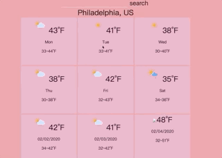

    input a city name , can get 9 days weather report
    the simple app including skills like:
    React,
    Error bounday,
    state management,
    ES6 : such like arrorw functions,
    CSS: grid align,
    Accessibility,
    Performance improvement,
    lazy-load for svg,
    sample unit test for App,
    react component incline style,
    webpack
    

